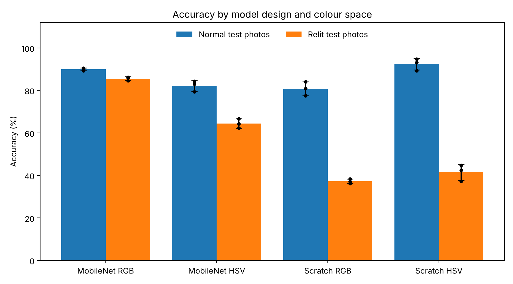

# Plant Health Capstone — RGB vs HSV Preprocessing

An independent project testing whether HSV colour-space preprocessing improves convolutional neural network accuracy on plant disease classification, compared to standard RGB input.

**Status:** Main experiment complete. 12 models trained and evaluated (October 2026). Next: a lighting test on my own leaf photos, a per-class analysis, and a write-up as a research paper.

---

## The question

Plant disease is usually diagnosed visually, from discolouration, lesions and texture changes on leaves. Most image classifiers feed RGB pixels straight into the network. RGB entangles colour with brightness — the same leaf photographed in shade and in sun produces very different RGB values.

HSV separates hue and saturation from brightness (value). In principle this should make a model less sensitive to lighting variation, which matters for disease symptoms that are essentially colour changes. In practice it is not obvious that it helps, since CNNs can learn lighting invariance on their own given enough data.

This project tests it directly: same architecture, same data, same training procedure, with only the colour space changed.

## Dataset

The PlantVillage dataset, via the [emmarex/plantdisease](https://www.kaggle.com/datasets/emmarex/plantdisease) Kaggle mirror.

Scope was narrowed to three crops — **bell pepper, potato and tomato** — giving 15 classes covering both diseased and healthy leaves, 20,638 images in total. Mint and cucumber were in the original plan but are not present in this dataset, so they were dropped rather than substituted.

## Results so far

Each model design was trained three times per colour space, with a different random seed each time: 12 runs in total. Figures are the mean ± standard deviation across the three runs, in %.

| Model | Input | Test accuracy | Test macro F1 | Relit test accuracy | Lighting drop |
|---|---|---|---|---|---|
| MobileNetV2, pretrained | RGB | 89.9 ± 0.6 | 88.7 ± 0.9 | 85.6 ± 0.9 | 4.4 ± 0.3 |
| MobileNetV2, pretrained | HSV | 82.3 ± 2.6 | 80.4 ± 2.6 | 64.5 ± 2.2 | 17.8 ± 0.8 |
| Small CNN, from scratch | RGB | 80.8 ± 3.3 | 76.7 ± 2.8 | 37.3 ± 1.1 | 43.5 ± 2.8 |
| Small CNN, from scratch | HSV | 92.4 ± 2.8 | 91.2 ± 3.4 | 41.5 ± 3.8 | 50.9 ± 1.0 |

The *relit* test set is the same 3,096 test images with simulated lighting changes (see Method). *Lighting drop* is test accuracy minus relit accuracy; smaller means more robust to lighting.

**What this shows**

- **HSV helped the CNN trained from scratch.** Its test accuracy rose from 80.8% to 92.4% (Welch's t-test, p ≈ 0.01), the highest of the four.
- **HSV hurt the pretrained model.** MobileNetV2 learned its features from RGB photos (ImageNet), and its test accuracy fell from 89.9% to 82.3% with HSV input (p ≈ 0.03).
- **The lighting hypothesis was not supported.** Every model lost accuracy on the relit images, and HSV did not reduce the loss. For the scratch CNN the drop was larger with HSV (50.9 vs 43.5 points, p ≈ 0.03), although it still finished slightly ahead in relit accuracy (41.5% vs 37.3%, not statistically significant). The most lighting-robust model was the pretrained MobileNetV2 with RGB input.

So far, HSV looks like a useful input representation for a small CNN trained from scratch, but not a fix for lighting variation. The per-class analysis (next) should help explain why.

The numbers for every run are in [`results/results.csv`](results/results.csv), with the summary in [`table1_main_results.csv`](results/table1_main_results.csv) and the significance tests in [`table2_hsv_vs_rgb_tests.csv`](results/table2_hsv_vs_rgb_tests.csv).

## Method

The comparison only means something if everything except colour space is held constant. Within each model design, the RGB and HSV runs share the same architecture, data split, seeds, augmentation and number of epochs, and differ only in the colour-conversion step.

- **Split:** stratified 70/15/15 (each class split separately), giving 14,446 training, 3,096 validation and 3,096 test images. Same fixed split for every run.
- **Input:** images resized to 224×224. Augmentation (horizontal flip, rotation, zoom) is applied to training images only, *before* colour conversion, so RGB and HSV models see the same augmented images.
- **Colour conversion:** TensorFlow's `rgb_to_hsv`, with all three channels scaled to the same 0–255 range as RGB.
- **Two model designs:**
  - MobileNetV2 pretrained on ImageNet, convolutional layers frozen, 10 epochs.
  - A small four-block CNN trained from scratch, 15 epochs.

  The pretrained model learned from RGB photos, which gives RGB a built-in advantage. The from-scratch CNN has no such bias, so it is the fairer test of the colour-space question.
- **Repeats:** 3 random seeds per condition, since a single run of each is not enough to separate a real difference from training noise.
- **Relit test set:** each test image gets a brightness change (0.4× to 1.6×), a contrast change and a slight warm or cool tint. The changes are random but fixed per image, so every model sees identical relit images. The tint is there because real sun and shade change colour as well as brightness, so the test doesn't favour HSV by construction.
- **Metrics:** accuracy and macro F1. Macro F1 weights every class equally, which matters here because class sizes range from about 150 to over 3,000 images.

## Limitations

- Three runs per condition is the minimum needed to measure spread, so the significance tests are only a rough guide.
- Each run was scored at its final epoch. The scratch CNN's validation accuracy fluctuated between epochs, which adds noise to its results.
- The relit test set is simulated lighting, not real photographs.
- PlantVillage images are single leaves on plain backgrounds under controlled lighting, so accuracy here does not transfer directly to garden or field conditions.
- The last two runs used TensorFlow 2.21 instead of 2.20, because Colab updated its runtime between sessions.

## Progress

**Done**

- Colab environment configured, TensorFlow running on GPU
- Worked through the [TensorFlow image classification tutorial](https://www.tensorflow.org/tutorials/images/classification) end to end, including diagnosing an overfitting model and correcting it with data augmentation and dropout
- Dataset downloaded, inspected and stored persistently on Google Drive
- Class scope finalised at 15 classes across three crops
- Training pipeline built on the PlantVillage data
- 12 models trained (2 designs × 2 colour spaces × 3 seeds), each evaluated on the standard and relit test sets

**Next**

- **Lighting test on my own photos.** Our home garden has guava, mango, lemon and Malabar spinach, none of which the models were trained on. Each leaf is photographed in sun, shade and indoor light. Because the plants are unfamiliar, this can't measure accuracy. Instead it tests whether a model's answer changes with lighting alone, and how confident the models are about plants they don't know.
- **Per-class analysis:** which diseases HSV helps or hurts, and the most common confusions.
- **Write-up** as a research paper on precision agriculture.

## Repository contents

| File | What it is |
|------|------------|
| [`plant_health_capstone.ipynb`](plant_health_capstone.ipynb) | Phases 1–3. Part 1 follows the official TensorFlow image classification tutorial as a learning exercise; Part 2 is the capstone dataset preparation. |
| [`phases_4_to_6_experiment.ipynb`](phases_4_to_6_experiment.ipynb) | Phases 4–6: the data pipeline, training of the 12 RGB and HSV models, and evaluation. |
| [`phase7_my_photos.ipynb`](phase7_my_photos.ipynb) | Phase 7: runs the trained models on my own leaf photos. Ready; photos still to be taken. |
| [`phase8_analysis.ipynb`](phase8_analysis.ipynb) | Phase 8: summary tables, significance tests, per-class F1, common mistakes and training stability. Ready to run. |
| [`results/`](results/) | Results of the 12 runs, the summary tables and the figure above. |

Outputs are cleared from the committed notebooks to keep them renderable on GitHub.

## Running this yourself

Open any notebook in Colab from GitHub (File → Open notebook → GitHub). Part 1 of the main notebook runs as-is. Part 2 downloads the dataset from Kaggle, so it requires your own Kaggle API token (`kaggle.json`, available from your Kaggle account settings) and a Google Drive mount for persistent storage.

The experiment notebook expects the dataset on Google Drive, as saved by Part 2, and a GPU runtime. On Colab's free GPU the 12 runs took about 7 hours of training, spread over several sessions. Finished runs are saved to Drive and skipped on a re-run, so it can resume after a disconnect. The Phase 7 and 8 notebooks run on CPU.

## Attribution

Part 1 of the main notebook is adapted from the official [TensorFlow image classification tutorial](https://www.tensorflow.org/tutorials/images/classification), used to learn the Keras workflow before applying it to my own problem. It is included because it documents how I got up to speed, not as original work.

The PlantVillage dataset was published by Hughes and Salathé (2015), *An open access repository of images on plant health to enable the development of mobile disease diagnostics*, arXiv:1511.08060.

MobileNetV2 is from Sandler et al. (2018), *MobileNetV2: Inverted Residuals and Linear Bottlenecks*, CVPR 2018.

## About

Independent capstone project, begun 2026. I'm a Computer Science applicant interested in machine learning applied to agriculture and climate adaptation. I maintain a related observation log of plant phenology in Dhaka in a [separate repository](https://github.com/AhnafArib/dhaka-orchid-phenology).
